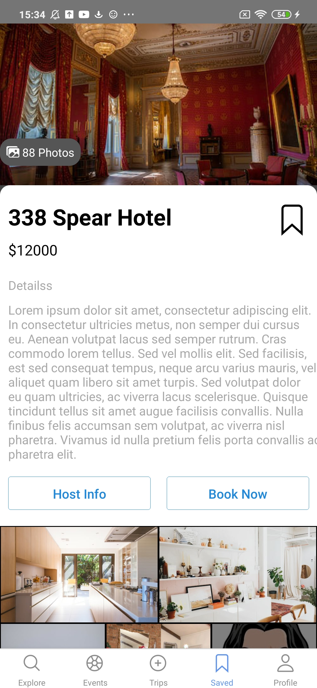
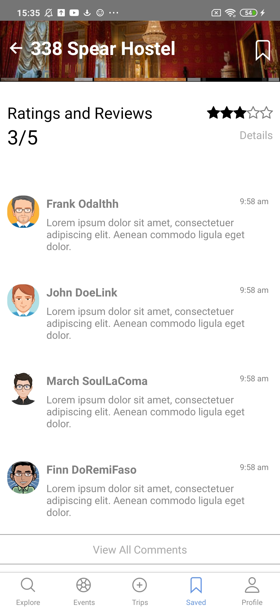
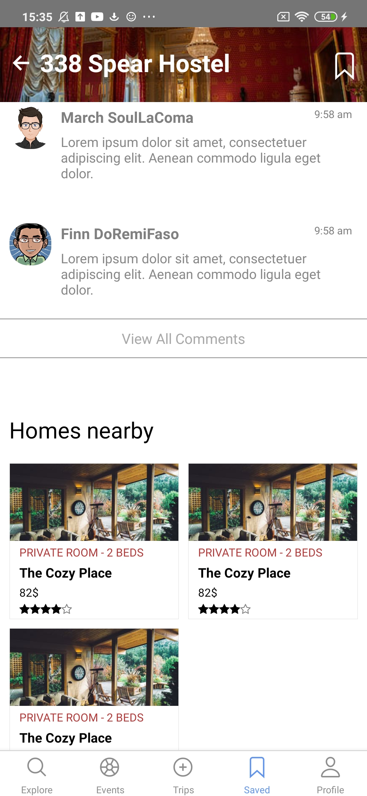
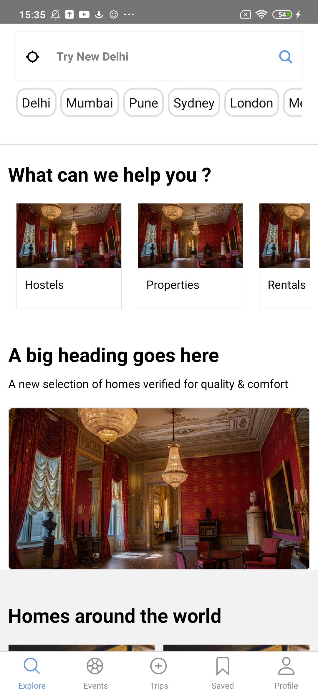
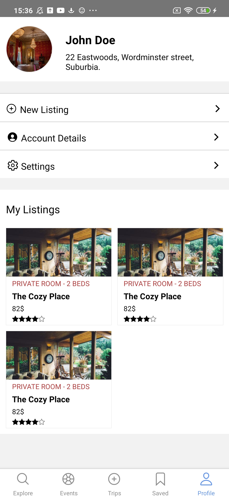
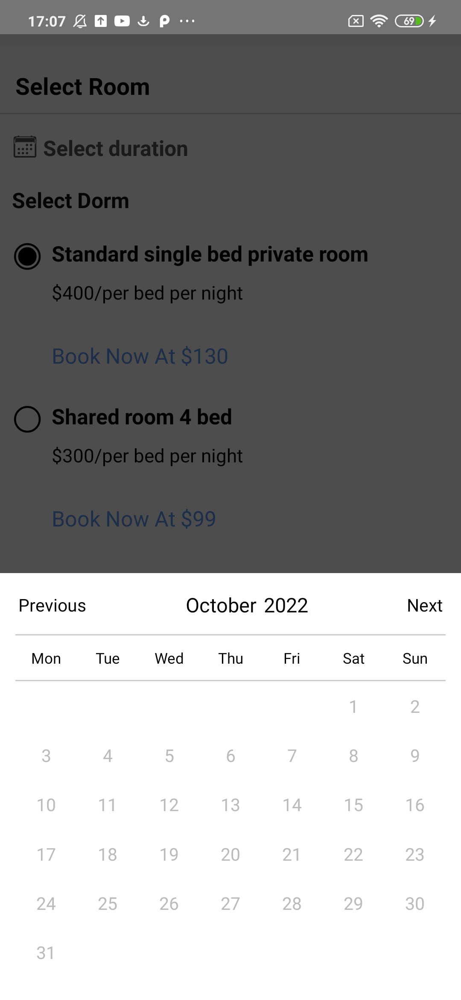
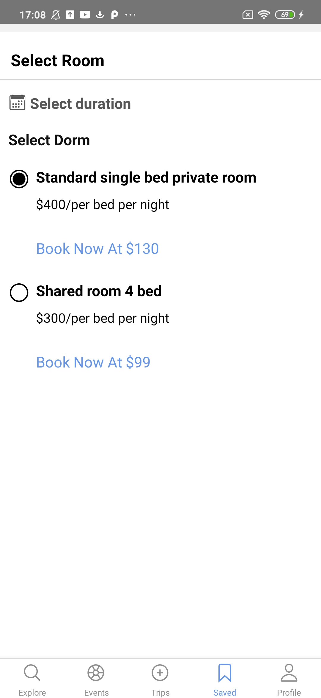
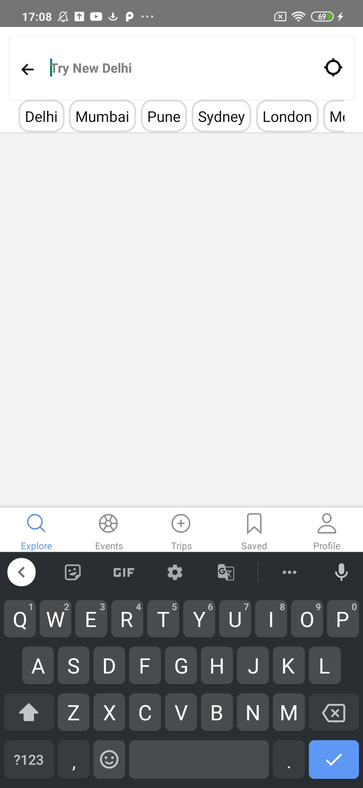

## An accomodation booking app

A simple react native app keeping in mind good design practises and better user experience.This example was put together by me for enthusiasts and those learning more about javascript and its framwork react-native.

### Running

- `npm i`

  
  
  
  
  
  
  
  
  

